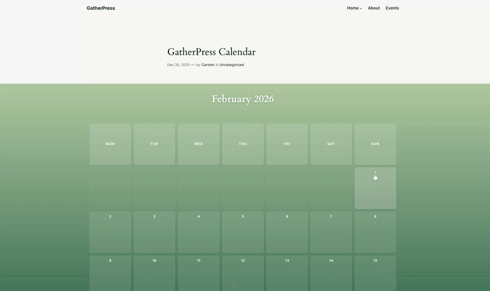
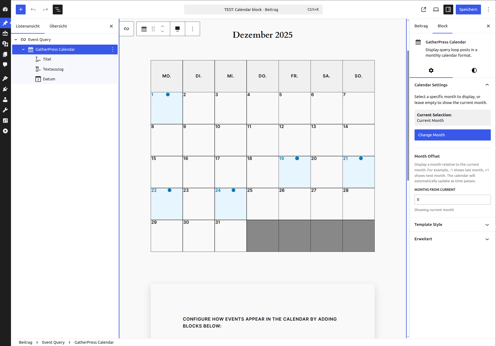

# GatherPress Calendar

**Contributors:** carstenbach & WordPress Telex  
**Tags:** block, calendar, gatherpress, events, query-loop  
**Tested up to:** 6.8  
**Stable tag:** 0.1.0  
**License:** GPLv2 or later  
**License URI:** <https://www.gnu.org/licenses/gpl-2.0.html>  
**Requires at least:** 6.0  
**Requires PHP:** 7.4  

A calendar block that displays Query Loop results in a monthly calendar format. Works with any post type, with specialized support for GatherPress events.

[](https://playground.wordpress.net/?blueprint-url=https://raw.githubusercontent.com/carstingaxion/gatherpress-calendar/main/.wordpress-org/blueprints/blueprint.json) [](https://github.com/carstingaxion/gatherpress-calendar/actions/workflows/build-test-measure.yml)

---



## Description

GatherPress Calendar is a WordPress block that renders Query Loop results as a monthly calendar. It integrates with the WordPress Query Loop block to display posts organized by their publication date (or event date for GatherPress events) in a structured calendar view.

https://github.com/user-attachments/assets/7089ef0c-e2aa-417a-a3fb-a5861315869b

---

## Core Functionality

### Query Loop Integration

The block must be used as a child of the core Query Loop block. It reads the query context and displays matching posts in a calendar grid based on their dates.

### Date-Based Display

- Posts are placed on calendar days according to their publication date  
- For GatherPress events, uses GatherPress' own event database-table
- Automatically filters the query to only fetch posts within the displayed month for performance  

### Month Selection

- **Default:** Displays the current month  
- **Manual Selection:** Choose any specific month from a date picker  
- **Month Modifier:** Display months relative to current (e.g., `-1` for last month, `+1` for next month)  
- When a modifier is set, the calendar automatically updates as time passes  

### Post Template System

Uses WordPress InnerBlocks to define how each post appears in the calendar:

- Configure once in the editor  
- Supports any core post blocks (Post Title, Post Date, Post Excerpt, etc.)  
- Template applies to all posts in the calendar  

### Progressive Enhancement

- Without JavaScript: Event dots are clickable links to post permalinks  
- With JavaScript: Clicking dots shows a popover overlay with post content  
- Keyboard accessible with Escape key to close and full focus management  

---

## Display Features

### Responsive Design

- Uses CSS container queries for optimal display at any width  
- Hides day name headers on very narrow screens (< 400px)  
- Square day cells maintained with CSS `aspect-ratio`  
- All layouts tested from 320px to 2560px viewports  

### Visual Indicators

- **Today's date:** Highlighted with color and underline  
- **Days with posts:** Subtle background color and underline  
- **Multiple events per day:** Shown as colored dots (up to 6 colors, then gray)  

### Block Styles

Five distinct visual presentations:

1. **Classic:** Traditional calendar with borders and backgrounds  
2. **Minimal:** Clean, borderless design with subtle spacing  
3. **Bold:** High contrast with thick borders and strong typography  
4. **Circular:** Rounded cells with soft shadows  
5. **Gradient:** Colorful gradient background with glass-morphism effects  

### Customizable Popover Styling

Control the appearance of event popovers:

- Background color  
- Padding (top, right, bottom, left)  
- Border (width, style, color, radius)  
- Box shadow blur  

---

## Technical Implementation

### Dynamic Rendering

The block uses server-side rendering (`render.php`) to:

- Access the full Query Loop context  
- Generate calendar structure with proper post data  
- Apply WordPress date/time formatting and translations  
- Respect the `start_of_week` WordPress option  

### Localization

- Day names use WordPress core translations via `wp_date()`  
- Month names use WordPress date formatting  
- Automatically adapts to site language and regional settings  

### Query Optimization

The block injects a `date_query` parameter into the Query Loop:

```php
array(
    'year'  => 2025,
    'month' => 1
);
```

This limits database queries to only posts within the displayed month, improving performance for large post archives.

### GatherPress Integration

When used with GatherPress events:

- Reads event start date from GatherPress' own event database-table
- Automatically removes conflicting query parameters like 'upcoming' or 'past'

## Usage Instructions



### Basic Setup

1. Add a Query Loop block to your page
2. Configure the Query Loop to fetch your desired posts (post type, taxonomy, etc.)
3. Inside the Query Loop, add the GatherPress Calendar block
4. Add post blocks (Post Title, Post Date, etc.) inside the calendar to define your template
5. The calendar will display posts organized by date

### Month Configuration

- Leave "Current Selection" empty to show the current month
- Click "Change Month" to select a specific month
- Use "Month Offset" to display relative months (-1 = last month, +1 = next month)
- Month offset only works when no specific month is selected

### Styling

- Choose a block style from the styles panel (Classic, Minimal, Bold, Circular, Gradient)
- Customize popover appearance in the "Template Style" panel
- Use WordPress theme.json to override colors and spacing

### Post Types

The block works with any post type:

- Posts: Uses publication date
- Pages: Uses publication date
- Custom Post Types: Uses publication date
- GatherPress Events: Uses event start date

## Installation

1. Upload the plugin files to `/wp-content/plugins/gatherpress-calendar/`
2. Activate the plugin through the 'Plugins' screen in WordPress
3. Add a Query Loop block to your content
4. Insert the GatherPress Calendar block inside the Query Loop
5. Configure the calendar and post template to your needs

## Frequently Asked Questions

### Why must the block be inside a Query Loop?

The block reads the Query Loop's context to determine which posts to display. This allows you to use WordPress's powerful query building interface to filter posts by taxonomy, author, date range, search terms, etc.

### How does it determine which date to use?

For standard posts and custom post types, it uses the publication date. For GatherPress events, it uses the event start date from the `gatherpress_datetime_start` meta field.

### Can I show multiple posts on the same day?

Yes. Each post appears as a colored dot on its date. Click or tap the dot to see the post content in a popover.

### Does it work without JavaScript?

Yes. The dots are regular links. Without JavaScript, clicking a dot navigates to the post. JavaScript adds the popover overlay as progressive enhancement.

### How do I change what shows in the popover?

Add or remove blocks inside the calendar in the editor. Any blocks you add (Post Title, Post Excerpt, Post Featured Image, etc.) will appear in the popover for each post.

### Can I display past or future months?

Yes. Use the month picker to select a specific month, or use the month offset feature to display months relative to current (e.g., -2 for two months ago).

### How does it handle different locales?

The block uses WordPress's `wp_date()` function for all date formatting and respects the `start_of_week` option. Day and month names automatically translate to your site language.

## Screenshots

1. Classic calendar style showing GatherPress events
2. Calendar configuration in the block editor
3. Minimal block style with clean design
4. Bold block style with high contrast
5. Circular block style with rounded cells
6. Gradient block style with colorful background
7. Popover showing event details on mobile
8. Template configuration interface in editor

## Changelog

All notable changes to this project will be documented in the [CHANGELOG.md](CHANGELOG.md).
