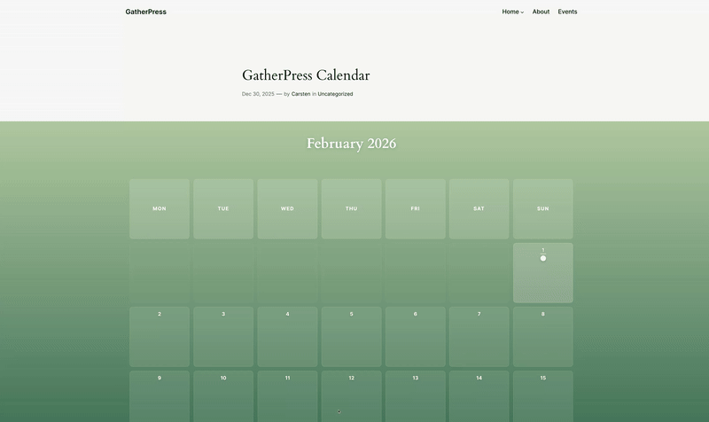

# GatherPress Calendar

**Contributors:** carstenbach & WordPress Telex  
**Tags:** block, calendar, gatherpress, events, query-loop  
**Tested up to:** 7.1  
**Stable tag:** 0.4.2  
**License:** GPLv2 or later  
**License URI:** <https://www.gnu.org/licenses/gpl-2.0.html>  

A set of WordPress blocks that renders Query Loop results in monthly, weekly, or daily calendar layouts. Works with standard WordPress posts, custom post types, and GatherPress events.

[](https://playground.wordpress.net/?blueprint-url=https://raw.githubusercontent.com/carstingaxion/gatherpress-calendar/main/.wordpress-org/blueprints/blueprint.json) [](https://github.com/carstingaxion/gatherpress-calendar/actions/workflows/build-test-measure.yml)

---



## Description

GatherPress Calendar is a WordPress block that renders Query Loop results as a monthly, weekly, or daily calendar. It integrates with the WordPress Query Loop block to display posts organized by their publication date (or event date for GatherPress events) in a structured, accessible calendar grid.

https://github.com/user-attachments/assets/7089ef0c-e2aa-417a-a3fb-a5861315869b

---

## Block Architecture

The calendar is divided into modular nested blocks configured inside WordPress's core `core/query` block:

```text
core/query
└── gatherpress/calendar
    └── gatherpress/calendar-week
        └── gatherpress/calendar-day
            ├── core/paragraph (bound to day number)
            └── gatherpress/calendar-entries
                └── [Your Post Template Blocks] (e.g., Post Title, Post Date)
```

### 1. Calendar (`gatherpress/calendar`)
* **Ancestor:** Must be placed inside a `core/query` block.
* **Views:** Configurable via `viewType` (`month`, `week`, or `day`).
* **Attributes:** Manages `selectedDate`, `dateModifier`, `showWeekdays`, and `showWeekends`.
* **Rendering:** Sets up responsive CSS Grid table wrappers, adjusts column counts (7, workday count, or 1 in day view), and applies view modifiers (`.is-view-month`, `.is-view-week`, `.is-view-day`).
* Supports color, spacing, borders, and Interactivity API client-side navigation.

### 2. Calendar Week (`gatherpress/calendar-week`)
* **Parent:** `gatherpress/calendar`.
* **Rendering:** Renders week table rows (`<tr>`) formatted to flow cleanly inside CSS Grid via `display: contents`.
* Operates in all views: outputs multi-week grids in month view, a single continuous row in week view, and a single cell row in day view.

### 3. Calendar Day (`gatherpress/calendar-day`)
* **Parent:** `gatherpress/calendar-week`.
* **Rendering:** Renders individual day cells (`<td>`).
* **Context Provided:** `gatherpress/dayDate`, `gatherpress/dayNumber`, `gatherpress/dayPosts`, `gatherpress/isEmpty`, `gatherpress/isToday`, `gatherpress/weekday`, `gatherpress/isWeekend`.
* Supports native layout controls (Flex), colors, borders, drop shadows, spacing, and typography.

### 4. Calendar Entries (`gatherpress/calendar-entries`)
* **Parent:** `gatherpress/calendar-day`.
* **Rendering:** Iterates over `gatherpress/dayPosts` (similar to `core/post-template`).
* Renders its inner blocks once per post, injecting `postId` and `postType` context into each entry.
* Supports Flex and Grid layout controls, block gap, colors, borders, shadows, and spacing.

---

## Block Bindings

The plugin registers two core Block Bindings sources:

### `gatherpress/calendar-heading`
Binds the active calendar heading to a `core/heading` or `core/paragraph` block placed anywhere inside the same Query Loop.
* **Context used:** `query`.
* **Dynamic Formatting:**
  * **Month view:** Localized "Month Year" string (e.g., `September 2026`).
  * **Week view:** Span of visible days (e.g., `Sep. 14 – 20, 2026`). When weekends are hidden, it automatically adjusts to reflect the visible range (e.g., `Sep. 14 – 18, 2026`).
  * **Day view:** Full date string (e.g., `Monday, September 14, 2026`).

### `gatherpress/calendar-day`
Binds the day number to text/paragraph blocks inside a day cell.
* **Context used:** `gatherpress/dayNumber`, `gatherpress/isEmpty`.
* Outputs the numeric day of the month automatically without custom markup.

---

## Query Loop & Pagination Integration

* **Date Range Querying:** Employs inclusive date boundaries (`after` and `before` with `inclusive => true`) within `WP_Query` and REST requests based on `start_date` and `end_date`. This guarantees weeks spanning across month or year boundaries never clip events.
* **Step-Aware Pagination:** Fully compatible with `core/query-pagination-previous` and `core/query-pagination-next`. Steps through pages by the active unit:
  * **Month view:** Advances by 1 month.
  * **Week view:** Advances by 1 week (7 days).
  * **Day view:** Advances by 1 day.
* **Client Navigation:** Supports WordPress Interactivity API client-side navigation without full-page reloads.
* **Numeric Pagination Suppression:** Silently suppresses `core/query-pagination-numbers` within calendar queries to prevent invalid page index requests.

---

## Date Resolution & Post Types

* **Standard Posts & Custom Post Types:** Placed according to publication date (`post_date`).
* **GatherPress Events:** Placed using the start timestamp from GatherPress's event table (`datetime_start_gmt`). Conflicting past/upcoming query filters are removed automatically.
* **Target Navigation Controls:**
  * **Calendar View (`viewType`):** Switch between `month`, `week`, and `day`.
  * **Specific Date (`selectedDate`):** Target a specific date (`YYYY-MM-DD` or `YYYY-MM`).
  * **Relative Offset (`dateModifier`):** Relative offset integer that adapts to the active view:
    * In Month view: offset by months (`-1` = last month, `+1` = next month).
    * In Week view: offset by weeks (`-1` = last week, `+1` = next week).
    * In Day view: offset by days (`-1` = yesterday, `+1` = tomorrow).

---

## Display & Styling

### Block Styles

* **`gatherpress/calendar`:**
  * `default` (Classic)
  * `minimal` (Minimal)
  * `bold` (Bold)
  * `circular` (Circular)
  * `gradient` (Gradient)
* **`gatherpress/calendar-entries`:**
  * `default` (Classic list/template layout)
  * `dots` (Colored status indicators)

### Weekday & Weekend Configuration

* **`showWeekdays` (boolean):** Toggles table header row (`<th>`) visibility.
* **`showWeekends` (boolean):** Toggles weekend columns in month and week views.
* **Filterable Weekend Days:** Filter `gatherpress_calendar_weekend_days` allows customizing which days are treated as weekends (defaults to `0` [Sunday] and `6` [Saturday]):

```php
add_filter( 'gatherpress_calendar_weekend_days', function() {
    return array( 5, 6 ); // Friday and Saturday
} );
```

### Responsive Behavior

* Uses CSS Container Queries (`@container calendar (max-width: 400px)`) to hide weekday headers and scale cell contents automatically in narrow containers.
* Fallback media queries provided for environments without container query support.

---

## Installation & Setup

1. Ensure the **GatherPress** plugin is installed and activated.
2. Upload the plugin files to `/wp-content/plugins/gatherpress-calendar/`.
3. Activate the plugin.
4. Add an **Event Calendar** block (variation) to any page or template.
5. In the block settings sidebar, select your preferred view (**Month**, **Week**, or **Day**).
6. Customize inner blocks inside the day cell's template to format event entries.


## Screenshots

1. Classic calendar style showing GatherPress events
2. Calendar configuration in the block editor
3. Minimal block style with clean design
4. Bold block style with high contrast
5. Circular block style with rounded cells
6. Gradient block style with colorful background
7. Popover showing event details on mobile
8. Template configuration interface in editor

## Changelog

All notable changes to this project will be documented in the [CHANGELOG.md](CHANGELOG.md).
