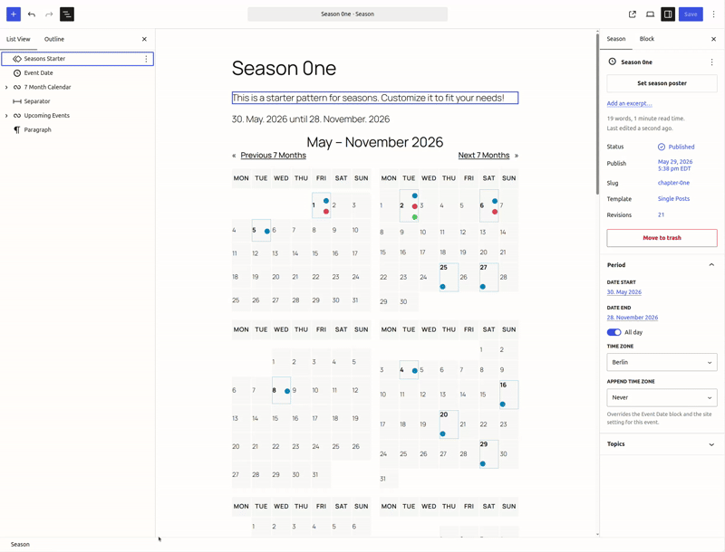
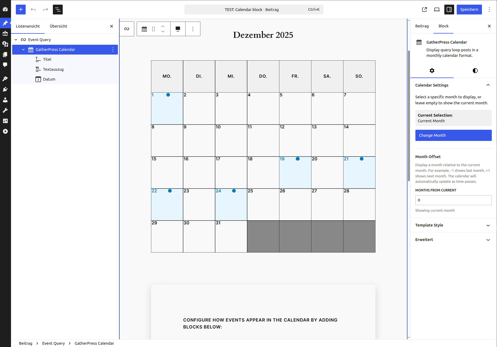

# GatherPress Calendar

**Contributors:** carstenbach, matthewneilcowan, faisalahammad & WordPress Telex  
**Tags:** block, calendar, gatherpress, events, query-loop  
**Tested up to:** 7.1  
**Stable tag:** 0.8.0  
**License:** GPLv2 or later  
**License URI:** <https://www.gnu.org/licenses/gpl-2.0.html>  

A set of WordPress blocks that renders Query Loop results in monthly, weekly, or daily calendar layouts. Works with standard WordPress posts, custom post types, and GatherPress events.

[](https://playground.wordpress.net/?blueprint-url=https://raw.githubusercontent.com/carstingaxion/gatherpress-calendar/main/.wordpress-org/blueprints/blueprint.json) [](https://github.com/carstingaxion/gatherpress-calendar/actions/workflows/build-test-measure.yml)

---

> [!WARNING]
> This project is under active development. The blocks currently do not handle schema deprecations, and all functionality is planned to be merged directly into GatherPress core.

---


## Description

GatherPress Calendar is a WordPress block that renders Query Loop results as a monthly, weekly, or daily calendar. It integrates with the WordPress Query Loop block to display posts organized by their publication date (or event date for GatherPress events) in a structured, accessible calendar grid.

---

## Block Architecture

The calendar is divided into modular nested blocks configured inside WordPress's core `core/query` block:

```text
core/query
├── core/heading (bound to the selected date-range)
└── gatherpress/calendar
    └── gatherpress/calendar-week
        └── gatherpress/calendar-day
            ├── core/paragraph (bound to day number)
            └── gatherpress/calendar-entries
                └── [Your Post Template Blocks] (e.g., Post Title, Post Date)
```

### 1. Calendar (`gatherpress/calendar`)

* **Ancestor:** Must be placed inside a `core/query` block.
* **Views:** Configurable via `viewType` (month, week, or day).
* **Attributes:** `viewType`, `unitCount`, `selectedDate`, `dateModifier`, `showWeekdays`, and `showWeekends`.
* **Rendering:** Sets up responsive CSS Grid table wrappers, adjusts column counts (7, workday count, or N in day view), and applies view modifiers (`.is-view-month`, `.is-view-week`, `.is-view-day`, `.has-multiple-units`).
* Supports color, spacing, borders, and Interactivity API client-side navigation.

### 2. Calendar Week (`gatherpress/calendar-week`)

* **Parent:** `gatherpress/calendar`.
* **Rendering:** Renders week table rows (`<tr>`) formatted to flow cleanly inside CSS Grid via `display: contents`.
* Operates in all views: outputs multi-week grids in month view, a single continuous row in week view, and a single cell row in day view.

### 3. Calendar Day (`gatherpress/calendar-day`)

* **Parent:** `gatherpress/calendar-week`.
* **Rendering:** Renders individual day cells (`<td>`).
* **Context Provided:** `gatherpress/dayDate`, `gatherpress/dayNumber`, `gatherpress/dayPosts`, `gatherpress/isEmpty`, `gatherpress/isToday`, `gatherpress/weekday`, `gatherpress/isWeekend`.
* **Inner Blocks:** Days with posts render all inner blocks in order. Days without posts only render the bound day number. Without a Day Number block in the template, no day number is shown.
* Supports native layout controls (Flex), colors, borders, drop shadows, spacing, and typography.

### 4. Calendar Entries (`gatherpress/calendar-entries`)

* **Parent:** `gatherpress/calendar-day`.
* **Rendering:** Iterates over `gatherpress/dayPosts` (similar to `core/post-template`).
* Renders its inner blocks once per post, injecting `postId` and `postType` context into each entry.
* Supports Flex and Grid layout controls, block gap, colors, borders, shadows, and spacing.

### Calendar Designs

The inserter has one **Event Calendar** block. After you insert it, choose **Start blank** and pick a design:

* **Event Modals:** every event shows in its day cell and opens its own modal.
* **Day Modal:** a click on a day opens one modal with all events of that day.

Other plugins can add a design with `registerBlockVariation( 'core/query', { scope: [ 'block' ], attributes: { namespace: [ 'gatherpress-calendar' ] }, innerBlocks: [ ... ] } )`.

### Day Modal Design

The **Day Modal** design lists the events of a day in a modal instead of inside the day cell. It uses the GatherPress Modal Manager blocks:

```text
gatherpress/calendar-day
├── core/paragraph (bound to day number)
└── gatherpress/modal-manager
    ├── core/buttons (.gatherpress-calendar__day-trigger)
    │   └── core/button (opens the modal, text bound to "Events on <date>", URL bound to the day archive)
    └── gatherpress/modal
        └── gatherpress/modal-content
            ├── core/heading (bound to the date)
            ├── gatherpress/calendar-entries
            └── core/buttons (Close)
```

On the front end, the trigger button covers the whole day cell. Its text is `Events on <date>` (for example `Events on Monday, October 5, 2026`), which screen readers read as the button name; it is hidden on screen.

The trigger is a link to the posts of that day: the date archive for posts, or the archive of the post type limited to that day for other post types (for events: `?gatherpress_event_query=all&gatherpress_calendar_start_date=<date>&gatherpress_calendar_end_date=<date>`). So it also works without JavaScript. With JavaScript, GatherPress opens the modal instead.

---

## Block Bindings

The plugin registers two core Block Bindings sources:

### `gatherpress/calendar-heading`

Binds the active calendar heading to a `core/heading` or `core/paragraph` block placed anywhere inside the same Query Loop.
* **Context used:** `query`.
* **Dynamic Formatting:**
  * **Month view:** Localized "Month Year" string (e.g., `September 2026`).
  * **Week view:** Span of visible days (e.g., `Sep. 14 – 20, 2026`). When weekends are hidden, it automatically adjusts to reflect the visible range (e.g., `Sep. 14 – 18, 2026`).
  * **Day view:** Full date string (e.g., `Monday, September 14, 2026`).

### `gatherpress/calendar-day`

Binds the day number to a paragraph or heading block (`content`) or a button block (`text`) inside a day cell.

* **Context used:** `gatherpress/dayNumber`,`gatherpress/dayDate`, `gatherpress/isEmpty`.
* **Custom Date Formatting:** Accepts an optional format argument in block bindings metadata (configurable in the editor inspector) supporting standard date formats such as:

    -   Default (`j`): 1, 2, 3...
    -   Leading Zero (`d`): 01, 02, 03...
    -   Ordinal (`jS`): 1st, 2nd, 3rd...
    -   Dot Suffix (`j.`): 1., 2., 3....
    -   Weekday & Day (`D j`): Mon 1, Tue 2...

---

## Date Range Sources & Event Anchoring



The calendar can anchor its date boundaries to a specific event, season, conference, or any post supporting `gatherpress-event-date` via the `dateRangeSource` attribute:

-   **Default (`dateRangeSource`: `'default'`):**  
    Standard rolling calendar behavior anchored to the viewer's current date, `selectedDate`, or relative `dateModifier` offsets.
-   **Current Post (`dateRangeSource`: `'context'`):**  
    Derives boundaries from the current post context (context.postId and context.postType).
    -   Active on single event templates, season templates, starter patterns, or within Query Loops.
    -   Automatically gated so the option is only available when the host post type declares `gatherpress-event-date` support.
    -   In the editor, subscribes directly to GatherPress's `gatherpress/datetime` data store, so date changes in the inspector update the calendar and heading on the canvas without saving.
-   **Specific Post (`dateRangeSource`: `'selected'`):**  
    Anchors boundaries to an explicit post chosen in the block inspector.
    -   If multiple post types declare `gatherpress-event-date` support (e.g., `gatherpress_event`, `gatherpress_seasons`, `my_conference`), a post type selector is displayed first. If only one post type exists, the selector is hidden.
    -   A search-enabled combobox lists matching published posts without filtering out past dates.

### Automatic Duration Span & Presets

When anchored to an event post (`context` or `selected`):

-   **Automatic Unit Calculation:** The block calculates the duration between start and end dates and sets `unitCount` to fit the post's span (e.g., a 7-month season sets 7 monthly tables; a 3-day conference sets 3 day columns).
-   **View Type Presets:** When a source post is chosen, `viewType` automatically presets based on event duration while remaining author-configurable.
-   **Streamlined UI:** Redundant manual controls (Number of units to show, Change Month, Specific Date, and Date Offset) are hidden when anchored to an event post to prevent contradictory date bounds.

    The Day Modal design uses two named formats, `dayModalHeading` (the date) and `dayModalTrigger` (`Events on <date>`). They are translated when the page renders, so the saved content does not hold the date format of the editor's language.

---

## Query Loop & Pagination Integration

* **Date Range Querying:** Employs inclusive date boundaries (`after` and `before` with `inclusive => true`) within `WP_Query` and REST requests based on `start_date` and `end_date`. This guarantees weeks spanning across month or year boundaries never clip events.
* **Step-Aware Pagination:** Fully compatible with `core/query-pagination-previous` and `core/query-pagination-next`. Steps through pages by the active view-type and unit:
  * **Month view:** Advances by N month.
  * **Week view:** Advances by N week (7 days).
  * **Day view:** Advances by N day.
* **Automatic Label & Name Syncing:**
    -   Pagination button labels react automatically to changes in `viewType` and `unitCount` (e.g., "Previous Month" / "Next Month", "Previous 3 Months" / "Next 3 Months", "Previous Day" / "Next Day"). Editors can still customize labels manually; changes only reset when the view type or unit count changes.
    -   Synchronizes the names of `core/query` and `calendar-heading` blocks in the editor list view (e.g., "3 Month Calendar", "3 Month Heading").
* **Client Navigation:** Supports WordPress Interactivity API client-side navigation without full-page reloads.
* **Numeric Pagination Suppression:** Silently suppresses `core/query-pagination-numbers` within calendar queries to prevent invalid page index requests.

---

## Date Resolution & Post Types

* **Standard Posts & Custom Post Types:** Placed according to publication date (`post_date`).
* **GatherPress Events & Post Types supporting `gatherpress-event-date`:** Placed using the start timestamp from GatherPress's event table (`datetime_start`). Conflicting past/upcoming query filters are removed automatically.
* **Target Navigation Controls:**
  * **Calendar View (`viewType`):** Switch between `month`, `week`, and `day`.
  * **Number of Units (`unitCount`):** An integer specifying how many consecutive units to render (defaults to 1):
    -   **Month view:** 1 to 12 months.
    -   **Week view:** 1 to 5 weeks.
    -   **Day view:** 1 to 7 days.
  * **Specific Date (`selectedDate`):** Target a specific date (`YYYY-MM-DD` or `YYYY-MM`).
  * **Relative Offset (`dateModifier`):** Relative offset integer that adapts to the active view:
    * In Month view: offset by months (`-1` = last month, `+1` = next month).
    * In Week view: offset by weeks (`-1` = last week, `+1` = next week).
    * In Day view: offset by days (`-1` = yesterday, `+1` = tomorrow).

## Display & Styling

### Multi-Unit Layouts & Modes

By pairing `viewType` with `unitCount`, the calendar adapts to specialized use cases:

-   **Conference / Festival Mode (`viewType: 'day', unitCount: 3`):**  
    Renders a single table row with 3 day columns (e.g., Day 1, Day 2, Day 3) starting from selectedDate. Perfect for multi-day conventions, festivals, or weekend retreats.
    
-   **Multi-Week Mode (`viewType: 'week', unitCount: 2`):**  
    Renders a 7-column grid containing 2 consecutive week rows (e.g., a 14-day rolling schedule).
    
-   **Multi-Month Mode (`viewType: 'month', unitCount: 3`):**  
    Renders 3 consecutive monthly tables , flowing side-by-side or stacked using CSS Flexbox.

### Block Styles

* **`gatherpress/calendar`:**
  * `default` (Classic)
  * `minimal` (Minimal)
  * `bold` (Bold)
  * `circular` (Circular)
  * `gradient` (Gradient)
* **`gatherpress/calendar-entries`:**
  * `default` (Classic list/template layout)
  * `dots` (Colored status indicators)

### Day Cell CSS Classes

Individual day cells (`<td>`) dynamically receive state and temporal CSS classes for fine-grained styling:

| Class Name | Description |
| --- | --- |
| `.gatherpress-calendar__day` | Base class present on every day cell. |
| `.is-empty` | Inactive padding cells preceding the 1st or following the last day of a month. |
| `.has-posts` | Applied when one or more posts/events occur on that day. |
| `.is-weekend` | Applied to days classified as weekend days. |
| `.is-{weekday}` | Weekday slug for the day (e.g., `.is-sunday`, `.is-monday`, `.is-tuesday`, etc.). |
| `.is-today` | Today's date (also sets `aria-current="date"`). Updated in real time via the Interactivity API. |
| `.is-past` | Dates in the past relative to the visitor's current date. |
| `.is-future` | Dates in the future relative to the visitor's current date. |

### Weekday & Weekend Configuration

* **`showWeekdays` (boolean):** Toggles table header row (`<th>`) visibility.
* **`showWeekends` (boolean):** Toggles weekend columns in month and week views.
* **Filterable Weekend Days:** Filter `gatherpress_calendar_weekend_days` allows customizing which days are treated as weekends (defaults to `0` [Sunday] and `6` [Saturday]):

```php
add_filter( 'gatherpress_calendar_weekend_days', function() {
    return array( 5, 6 ); // Friday and Saturday
} );
```

* **Filterable Query Limit:** Filter `gatherpress_calendar_posts_per_page` allows customizing the maximum number of posts queried for calendar display defaults to `500`):

```php
add_filter( 'gatherpress_calendar_posts_per_page', function() {
    return 1000;
} );
```

### Responsive Behavior

* Uses CSS Container Queries (`@container calendar (max-width: 400px)`) to hide weekday headers and scale cell contents automatically in narrow containers.
* Fallback media queries provided for environments without container query support.

---

## Installation & Setup

1. Ensure the **GatherPress** plugin is installed and activated.
2. Upload the plugin files to `/wp-content/plugins/gatherpress-calendar/`.
3. Activate the plugin.
4. Add an **Event Calendar** block (variation) to any page or template.
5. In the block settings sidebar, select your preferred view (**Month**, **Week**, or **Day**).
6. Customize inner blocks inside the day cell's template to format event entries.




## Screenshots

1. Calendar configuration in the block editor
2. Gradient block style with colorful background
3. Allow to define the date range via an event (or season)

## Changelog

All notable changes to this project will be documented in the [CHANGELOG.md](CHANGELOG.md).
